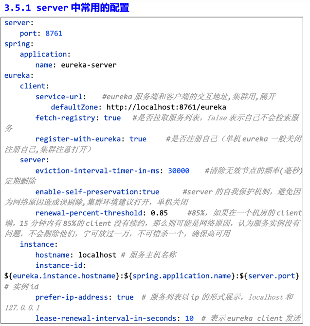
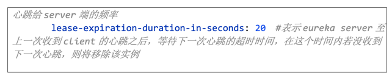

# sample

- eviction-interval-timer-in-ms: 30000
    - 设置定时删除：每隔30秒钟检查一次所有需要移除的服务，并且一并移除
- enable-self-preservation: true + renewal-percent-threshold: 0.85
  - 这两个属性需要一起配置。
  - 当 eureka server 未收到的注册服务心跳高于或等于 85% 时，会自动进入自我保护模式（可能是 eureka server 本身出现了问题）。此时，为了避免误删服务，定时清理任务不会删除那些没有心跳的服务。
- - `instance-id: ${eureka.instance.hostname}:${spring.application.name}:${random.value}` #Generates a random instance ID.
    - 这里的实例ID是由应用名和随机数值组成的，确保每个实例都有唯一的ID。
    - 这个ID会被放入eureka server的concurrentMap里面用来区分services with the same application name those registered with this eureka server
      - 我们通常会将一个服务的cluster里面的每个node assign 同一个application name。example：Order服务cluster有两个节点，application.yml里面设为同一个application name
      - 例如：可能有Order cluster，里面有两个Order Service节点，
        - 一个实例ID为：localhost:order-service:1234567890
        - 另一个实例ID为：localhost:order-service:0987654321
        - 这样就可以区分这两个节点了。
        - `Map<String, Map<String, Lease<InstanceInfo>>`
          - 详细解析：
            - 外层 Map 的键（即第一个 String）是 应用名，表示注册在 Eureka 中的不同服务。比如，如果你有一个名为 user-service 的服务，它的键就是 user-service。
            - 内层 Map 的键（即第二个 String）是 实例的 ID，每个应用名下可以有多个不同的服务实例，每个实例的 ID（通常是实例的 instanceId）是这个键。
            - 值是 Lease<InstanceInfo>，Lease 表示服务实例的租约信息，而 InstanceInfo 包含了实例的详细信息（如主机名、端口、健康状态等）。
- lease-renewal-interval-in-seconds: 30
    - 设置心跳间隔：规定每隔10秒钟，服务实例（注册在当前Eureka Server上的Eureka Clients）会向当前Eureka Server发送一次心跳，以表明它仍然活着。
- lease-expiration-duration-in-seconds: 90
    - 设置心跳过期时间：如果服务实例在90秒内没有发送心跳，Eureka Server会认为它已经下线，并在定时删除任务中将其从注册表中移除。
- **lease-renewal-interval-in-seconds，lease-expiration-duration-in-seconds 也可以在Eureka Client端进行配置，需要与Eureka Server端保持一致。**
